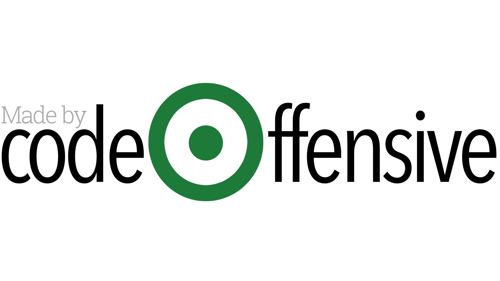

# Corporate Networks
Connect the dots between companies and the people who control them.

## Overview

### What is this application for?
Corporate Networks is a research tool for activists to explore the links between people and companies. It is both a more accessible of understanding relationship between companies and be a supplementary tool to the excellent resources already provided by [OpenCorporates](https://opencorporates.com/) and [Corporate Watch](https://corporatewatch.org/) 

By simply entering a company's UK Companies House ID, a user-friendly and interactive Corporate Network Map is produced providing details on:
* officers within the company (**Company A**)
* other companies (**Companies B+**) who share officers with **Company A** and officer information for **Companies B+**
* General information (address, industry, Companies House ID) for **Company A** and **Companies B+**
* Financial information submitted to UK Companies House (assets, liabilities, profits, charges). This information is sparse and dependent on the Companies House API. We have to work with the information provided. Useful links to OpenCorporates.com and Corporate Watch are embedded in the Corporate Network for users to explore finances, and company information in general, in more detail.

> When enabled, a **Company Network Helper** feature provides users with an overview of the information layout and site functionality. 

### How does it work?
The website is built on the [Flask](http://flask.palletsprojects.com/en/1.1.x/) microframework and written in **python 3.7.5**.

A [MongoDB](https://www.mongodb.com/) database is dynamically created, utilising the [pyMongo](https://api.mongodb.com/python/current/) distribution, and is populated based on users' search results. Information is accessed from both [Companies House API](https://developer.companieshouse.gov.uk/api/docs/) and the [OpenCorporates API](https://api.opencorporates.com/) based on the users' search requests. The database prevents duplicate API calls being made by accessing search history in the first instance.

[AIOHTTP](https://aiohttp.readthedocs.io/en/stable/) for asyncio and Python is used to make asynchronous API calls.

The [D3](https://d3js.org/) javascript library is used to render the Network Chart. 

The application is styled using HTML, CSS, and JavaScript (inc JQuery), developed in Visual Studio Code (v1.41.1) and is hosted on [pythonanywhere](https://www.pythonanywhere.com).

While waiting for the Corporate Network to be generated, latest News from Corporate Watch is displayed. This news is scraped from [Corporate Watch](https://corporatewatch.org/) once daily using the [Beautiful Soup](https://www.crummy.com/software/BeautifulSoup/bs4/doc/) python library.

### Development and Production
The following environment variables are managed using [python-dotenv](https://github.com/theskumar/python-dotenv) and stored in **.env** in the root officery (added to .gitignore):

* SECRET_KEY (required by Flask)
* MONGO_URI (provided by MongDB on database set-up)
* CH_KEY (your Companies House API Key)
* OC_KEY (your OpenCorporates API Key)

The development server is set in **.flaskenv**

If you do not have a Companies House API Key, apply for one [here](https://developer.companieshouse.gov.uk/api/docs/index/gettingStarted.html#createaccount)

If you do not have a OpenCorporates API Key, apply for one [here](https://opencorporates.com/users/sign_in) 


## Getting the code up and running
1. Create a virtual environment running python 3.7.5 as the default in your IDE
2. Clone this repository by running the ```git clone https://github.com/Deasun/CorporateNetworks.git``` command 
3. pip install requirements
4. Set your own environment variables 
5. The project will now run on localhost (http://127.0.0.1:5000/)

### Version 2.0
Key features to be improved include:
* sourcing more accurate and up to date financial information
* introducing a officer search facility


## License
This work is licensed under a [Creative Commons Attribution 4.0 International License](https://creativecommons.org/licenses/by/4.0/legalcode)

The [OpenCorporates](https://opencorporates.com/) database is made available under the [Open Database License (ODbL) v1.0](https://www.opendatacommons.org/licenses/odbl/1.0/) 

Icons on the site are produced by dDara at [Flaticon](https://www.flaticon.com/authors/ddara)

Information from [Corporate Watch](https://corporatewatch.org/) is share under the [Creative Commons Attribution-NonCommercial 3.0 Unported License](https://creativecommons.org/licenses/by-nc/3.0/deed.en_GB)

## Credits

### Developer
[codeOffensive](https://twitter.com/CodeOffensive)
Dessie Donnelly (email: des_donn@mailbox.org)

Equality Can't Wait & #BuildHomesNow campaign C/O PPR, Ground Floor, Community House, Citylink Business Park 6A Albert Street, Belfast, BT12 4HQ (tel: 028 90313315) Contact: Elfie Seymour (email: elfie@pprproject.org)